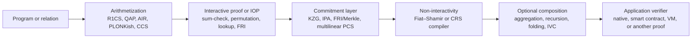

# A Research History of Zero-Knowledge Proofs

## Overview

Zero-knowledge research spans more than four decades. It began with interactive proofs that formalized how a prover can establish a statement without revealing its witness, then absorbed ideas from complexity theory, probabilistically checkable proofs, polynomial commitments, error-correcting codes, secure multiparty computation, and lattices. The result is a diverse family of practical argument systems used for private transactions, verifiable computation, rollups, identity protocols, and proof-carrying computation.

This guide is a curated history, not an exhaustive bibliography. It emphasizes primary papers that introduced a construction, security model, or systems technique that later work builds upon. Publication years refer to the first public or conference version when practical; linked ePrint versions may have been revised later.

Two distinctions matter throughout:

- A **proof** is sound even against a computationally unbounded prover; an **argument** is sound against efficient provers under stated assumptions.
- **Succinctness** and **zero knowledge** are separate properties. A SNARK or STARK can be used for verifiable computation without hiding the witness unless the construction and implementation add zero-knowledge masking.

## Contents

- [How modern proving systems fit together](#how-modern-proving-systems-fit-together)
- [Foundations: interactive proofs, NIZKs, and Sigma protocols](#foundations-interactive-proofs-nizks-and-sigma-protocols-19851994)
- [PCPs, sum-check, and delegated computation](#pcps-sum-check-and-delegated-computation-19902010)
- [Pairings, QAPs, and practical preprocessing SNARKs](#pairings-qaps-and-practical-preprocessing-snarks-20082017)
- [Universal and updatable SNARKs](#universal-and-updatable-snarks-20182020)
- [Lookup arguments and modern arithmetization](#lookup-arguments-and-modern-arithmetization)
- [Polynomial commitments as a design layer](#polynomial-commitments-as-a-design-layer)
- [Transparent and discrete-log arguments](#transparent-and-discrete-log-arguments)
- [IOPs, FRI, and STARKs](#iops-fri-and-starks)
- [Recursion, proof-carrying data, and folding](#recursion-proof-carrying-data-and-folding)
- [MPC-in-the-head and signature-oriented ZK](#mpc-in-the-head-and-signature-oriented-zk)
- [Lattice-based and post-quantum ZK](#lattice-based-and-post-quantum-zk)
- [Limits, assumptions, and composability](#limits-assumptions-and-composability)
- [Systems for verifiable computation](#systems-for-verifiable-computation)
- [From verified computation to zkVMs](#from-verified-computation-to-zkvms)
- [Surveys and longer treatments](#surveys-and-longer-treatments)
- [Construction map](#construction-map)
- [Suggested reading paths](#suggested-reading-paths)
- [Source and revision policy](#source-and-revision-policy)

## How modern proving systems fit together

A deployed proving system is usually a stack of separable choices rather than one indivisible protocol:

Changing one layer can change setup requirements, quantum assumptions, proof size, prover memory, verifier cost, or recursion compatibility without changing the application statement. This is why labels such as “PLONK,” “STARK,” or “zkVM” are not complete security or performance specifications.

## Foundations: interactive proofs, NIZKs, and Sigma protocols (1985–1994)

- **Goldwasser, Micali, Rackoff — [The Knowledge Complexity of Interactive Proof Systems](https://people.csail.mit.edu/silvio/Selected%20Scientific%20Papers/Proof%20Systems/The_Knowledge_Complexity_Of_Interactive_Proof_Systems.pdf) (STOC 1985; SIAM J. Computing 1989).** Introduced interactive proof systems and formal definitions of zero knowledge, including a protocol for quadratic non-residuosity.
- **Babai — [Trading Group Theory for Randomness](https://doi.org/10.1145/22145.22192) (STOC 1985).** Introduced Arthur–Merlin games, establishing the public-coin perspective used throughout interactive proof theory.
- **Fiat, Shamir — [How to Prove Yourself: Practical Solutions to Identification and Signature Problems](https://link.springer.com/chapter/10.1007/3-540-47721-7_12) (CRYPTO 1986).** Showed how public-coin identification protocols can be made non-interactive by deriving challenges with a hash function. Modern uses require a precise random-oracle analysis and careful transcript binding.
- **Goldreich, Micali, Wigderson — [Proofs That Yield Nothing but Their Validity](https://www.math.ias.edu/~avi/PUBLICATIONS/MYPAPERS/GMW86/GMW86.pdf) (FOCS 1986; JACM 1991) and [How to Play Any Mental Game](https://www.math.ias.edu/~avi/PUBLICATIONS/MYPAPERS/GMW87/GMW87.pdf) (STOC 1987).** Showed that every language in NP has a zero-knowledge proof assuming one-way functions, and connected zero knowledge with general secure computation.
- **Blum, Feldman, Micali — [Non-Interactive Zero-Knowledge and Its Applications](https://doi.org/10.1145/62212.62222) (STOC 1988).** Introduced non-interactive zero-knowledge in a shared random-string model, the conceptual origin of the common reference string used by many later NIZKs and SNARKs.
- **Schnorr — [Efficient Identification and Signatures for Smart Cards](https://link.springer.com/chapter/10.1007/0-387-34805-0_22) (CRYPTO 1989).** Gave the canonical discrete-log identification protocol. Its commit–challenge–response structure is the standard example of a Sigma protocol.
- **Ben-Or, Goldwasser, Kilian, Wigderson — [Multi-Prover Interactive Proofs: How to Remove Intractability Assumptions](https://doi.org/10.1145/62212.62223) (STOC 1988).** Introduced multi-prover interactive proofs with isolated provers, an important step toward the complexity-theoretic machinery behind succinct verification.
- **Kilian — [A Note on Efficient Zero-Knowledge Proofs and Arguments](https://doi.org/10.1145/129712.129782) (STOC 1992).** Combined probabilistically checkable proofs with cryptographic commitments to obtain communication-efficient arguments.
- **Cramer, Damgård, Schoenmakers — [Proofs of Partial Knowledge and Simplified Design of Witness Hiding Protocols](https://doi.org/10.1007/3-540-48658-5_19) (CRYPTO 1994).** Developed efficient AND/OR composition for Sigma protocols, making statements such as “I know one of these witnesses” practical without revealing which witness is known.

## PCPs, sum-check, and delegated computation (1990–2010)

This line of work made it possible to verify a large computation by checking only a small amount of encoded information. It supplies much of the conceptual machinery later packaged into SNARKs and STARKs.

- **Lund, Fortnow, Karloff, Nisan — [Algebraic Methods for Interactive Proof Systems](https://doi.org/10.1145/146585.146605) (JACM 1992).** Developed arithmetization and the sum-check protocol, now central to GKR-based systems, multilinear polynomial commitments, and many zkVMs.
- **Arora, Safra — [Probabilistic Checking of Proofs: A New Characterization of NP](https://doi.org/10.1145/174644.174649) (FOCS 1992; JACM 1998)** and **Arora et al. — [Proof Verification and the Hardness of Approximation Problems](https://doi.org/10.1145/278298.278306) (JACM 1998).** Established the PCP theorem and the possibility of checking encoded proofs with very few queries.
- **Kilian — [Improved Efficient Arguments](https://link.springer.com/chapter/10.1007/3-540-44750-4_23) (CRYPTO 1995).** Refined the PCP-plus-commitment route to succinct computational arguments.
- **Micali — [Computationally Sound Proofs](https://people.csail.mit.edu/silvio/Selected%20Scientific%20Papers/Proof%20Systems/Computationally_Sound_Proofs.pdf) (SIAM J. Computing 2000).** Developed non-interactive computationally sound proofs in the random-oracle model and helped crystallize the CS-proof lineage.
- **Goldwasser, Kalai, Rothblum — [Delegating Computation: Interactive Proofs for Muggles](https://eprint.iacr.org/2007/440) (STOC 2008).** Introduced the GKR protocol for layered arithmetic circuits, giving a verifier whose work can be much smaller than the computation being checked.
- **Gennaro, Gentry, Parno — [Non-Interactive Verifiable Computing: Outsourcing Computation to Untrusted Workers](https://eprint.iacr.org/2009/547) (CRYPTO 2010).** Constructed a non-interactive verifiable-computation scheme in the preprocessing model.

## Pairings, QAPs, and practical preprocessing SNARKs (2008–2017)

Bilinear pairings and algebraic encodings reduced large computations to a small number of group equations. These systems offer tiny proofs and fast verification, but generally rely on a structured reference string and pairing-based assumptions.

- **Groth, Sahai — [Efficient Non-Interactive Proof Systems for Bilinear Groups](https://eprint.iacr.org/2007/155) (EUROCRYPT 2008).** Gave efficient NIZK and witness-indistinguishable proofs for equations over bilinear groups. This is the Groth–Sahai system; it should not be confused with later general-purpose SNARKs by Groth.
- **Groth — [Short Pairing-Based Non-Interactive Zero-Knowledge Arguments](https://doi.org/10.1007/978-3-642-17373-8_19) (ASIACRYPT 2010).** Advanced constant-size pairing-based NIZK arguments for circuit satisfiability.
- **Kate, Zaverucha, Goldberg — [Constant-Size Commitments to Polynomials and Their Applications](https://www.iacr.org/archive/asiacrypt2010/6477178/6477178.pdf) (ASIACRYPT 2010).** Introduced KZG polynomial commitments, which later became a core component of Sonic, Marlin, PLONK, and Ethereum's blob commitments.
- **Gennaro, Gentry, Parno, Raykova — [Quadratic Span Programs and Succinct NIZKs without PCPs](https://eprint.iacr.org/2012/215) (EUROCRYPT 2013).** Introduced quadratic span programs and the quadratic arithmetic program formulation that enabled efficient circuit-specific SNARKs.
- **Parno, Howell, Gentry, Raykova — [Pinocchio: Nearly Practical Verifiable Computation](https://eprint.iacr.org/2013/279) (IEEE S&P 2013).** Built an end-to-end QAP-based system with a compiler from C-like programs, constant-size proofs, and fast verification.
- **Ben-Sasson, Chiesa, Genkin, Tromer, Virza — [SNARKs for C: Verifying Program Executions Succinctly and in Zero Knowledge](https://eprint.iacr.org/2013/507) (CRYPTO 2013).** Developed efficient compilation and SNARK techniques for program execution.
- **Ben-Sasson, Chiesa, Tromer, Virza — [Succinct Non-Interactive Zero Knowledge for a von Neumann Architecture](https://eprint.iacr.org/2013/879) (USENIX Security 2014).** Presented a program-independent architecture for proving RAM computations and informed the design of libsnark.
- **Ben-Sasson et al. — [Zerocash: Decentralized Anonymous Payments from Bitcoin](https://eprint.iacr.org/2014/349) (IEEE S&P 2014).** Applied zk-SNARKs to decentralized private payments and became the protocol basis for the original Zcash design.
- **Groth — [On the Size of Pairing-Based Non-Interactive Arguments](https://eprint.iacr.org/2016/260) (EUROCRYPT 2016).** Introduced Groth16: a circuit-specific preprocessing zk-SNARK with a three-group-element proof and verification dominated by three pairings. It remains widely deployed.
- **Groth, Maller — [Snarky Signatures: Minimal Signatures of Knowledge from Simulation-Extractable SNARKs](https://eprint.iacr.org/2017/540) (CRYPTO 2017)** and **Bowe, Gabizon — [Making Groth's zk-SNARK Simulation Extractable in the Random Oracle Model](https://eprint.iacr.org/2018/187) (2018).** Strengthened non-malleability and extraction guarantees needed when proofs are composed inside larger protocols.

## Universal and updatable SNARKs (2018–2020)

Universal systems replace a fresh ceremony for every circuit with parameters that support any circuit up to a size bound. Updatable parameters remain secure if at least one contribution is generated honestly and its secret randomness is destroyed.

- **Maller, Bowe, Kohlweiss, Meiklejohn — [Sonic: Zero-Knowledge SNARKs from Linear-Size Universal and Updatable Structured Reference Strings](https://eprint.iacr.org/2019/099) (CCS 2019).** Made universal, continually updatable structured reference strings practical with linear setup size.
- **Gabizon, Williamson, Ciobotaru — [PLONK: Permutations over Lagrange-Bases for Oecumenical Noninteractive Arguments of Knowledge](https://eprint.iacr.org/2019/953) (2019).** Introduced a flexible permutation argument and a universal circuit model that became the basis of the broad “PLONKish” family.
- **Chiesa et al. — [Marlin: Preprocessing zkSNARKs with Universal and Updatable SRS](https://eprint.iacr.org/2019/1047) (EUROCRYPT 2020).** Introduced algebraic holographic proofs and compiled them with polynomial commitments into an efficient universal preprocessing zk-SNARK.

## Lookup arguments and modern arithmetization

R1CS and QAPs encode computation primarily through multiplication constraints. PLONKish systems add permutation arguments, custom gates, and lookups, letting a circuit check membership in a table instead of expanding every operation into low-degree constraints. Customizable constraint systems (CCS) later provided a common language for several R1CS-, PLONKish-, and AIR-style relations.

- **Gabizon, Williamson — [Plookup: A Simplified Polynomial Protocol for Lookup Tables](https://eprint.iacr.org/2020/315) (2020).** Gave an influential lookup argument for proving that committed values occur in a fixed table, with range checks as a motivating application.
- **Chen et al. — [HyperPlonk: PLONK with Linear-Time Prover and High-Degree Custom Gates](https://eprint.iacr.org/2022/1355) (EUROCRYPT 2023).** Replaced FFT-oriented univariate machinery with multilinear-polynomial techniques, supporting high-degree custom gates and a linear-time prover.
- **Setty, Thaler, Wahby — [Unlocking the Lookup Singularity with Lasso](https://eprint.iacr.org/2023/1216) (2023).** Developed multilinear lookup arguments that can exploit structured tables too large to materialize explicitly, enabling lookup-centric VM designs.

## Polynomial commitments as a design layer

A polynomial commitment scheme (PCS) lets a prover commit to a polynomial and later prove evaluation claims. In many modern SNARKs, the arithmetization and polynomial IOP define what must be checked, while the PCS determines how those checks become succinct. The main families have different trust and performance profiles:

| PCS family | Representative work | Setup and assumptions | Characteristic trade-off |
|---|---|---|---|
| Pairing-based | [KZG](https://www.iacr.org/archive/asiacrypt2010/6477178/6477178.pdf) | Structured setup; pairing and algebraic assumptions | Constant-size openings and fast verification |
| Inner-product argument | [Bootle et al.](https://eprint.iacr.org/2016/263), [Bulletproofs](https://eprint.iacr.org/2017/1066) | Transparent; discrete-log assumptions | Logarithmic proofs but typically linear verifier work |
| Code and hash based | [FRI](https://eccc.weizmann.ac.il/report/2017/134/) | Transparent; hashes and coding assumptions | Post-quantum-oriented, with larger proofs |
| Unknown-order group | [DARK and Supersonic](https://eprint.iacr.org/2019/1229) | Transparent; unknown-order group assumptions | Short transparent proofs, but expensive group operations and not post-quantum |
| Multilinear/code based | [Brakedown](https://eprint.iacr.org/2021/1043) | Transparent; hashes and linear codes | Linear-time, field-agnostic prover with larger proofs and verifier cost |
| Binary-tower multilinear | [Succinct Arguments over Towers of Binary Fields](https://eprint.iacr.org/2023/1784) and [FRI-Binius](https://eprint.iacr.org/2024/504) | Transparent; binary-field coding and hash assumptions | Efficient bit-level arithmetization and low embedding overhead |

“Transparent” only describes parameter generation. It does not imply post-quantum security, zero knowledge, or an absence of cryptographic assumptions.

## Transparent and discrete-log arguments

Transparent systems avoid secret setup material. “Transparent” does not automatically mean post-quantum: discrete-log systems remain vulnerable to a sufficiently capable quantum computer, while hash-based systems are designed around different assumptions.

- **Bootle, Cerulli, Chaidos, Groth, Petit — [Efficient Zero-Knowledge Arguments for Arithmetic Circuits in the Discrete Log Setting](https://eprint.iacr.org/2016/263) (EUROCRYPT 2016).** Built logarithmic-communication inner-product and arithmetic-circuit arguments from discrete-log assumptions.
- **Bünz et al. — [Bulletproofs: Short Proofs for Confidential Transactions and More](https://eprint.iacr.org/2017/1066) (IEEE S&P 2018).** Turned inner-product arguments into practical logarithmic-size range proofs and circuit proofs with no trusted setup; verification is linear in circuit size.
- **Ames et al. — [Ligero: Lightweight Sublinear Arguments Without a Trusted Setup](https://eprint.iacr.org/2017/363) (CCS 2017).** Combined linear codes, commitments, and interactive checks into a transparent argument with sublinear communication.
- **Liu et al. — [SwiftRange: A Short and Efficient Zero-Knowledge Range Argument for Confidential Transactions and More](https://doi.org/10.1109/SP54263.2024.00162) (IEEE S&P 2024).** Improved the concrete size and efficiency of discrete-log range arguments. Its assumptions are not post-quantum.

## IOPs, FRI, and STARKs

Interactive oracle proofs (IOPs) combine interaction with oracle access to encoded polynomials. Fiat–Shamir and polynomial commitment techniques can compile them into non-interactive arguments.

- **Ben-Sasson, Chiesa, Spooner — [Interactive Oracle Proofs](https://eprint.iacr.org/2016/116) (TCC 2016).** Formalized the IOP model that unifies ideas from interactive proofs and PCPs.
- **Ben-Sasson et al. — [Fast Reed–Solomon Interactive Oracle Proofs of Proximity](https://eccc.weizmann.ac.il/report/2017/134/) (ICALP 2018).** Introduced FRI, an efficient protocol for testing proximity to low-degree Reed–Solomon codewords.
- **Ben-Sasson, Bentov, Horesh, Riabzev — [Scalable, Transparent, and Post-Quantum Secure Computational Integrity](https://eprint.iacr.org/2018/046) (2018).** Presented the STARK construction: transparent, hash-based arguments with fast proving and polylogarithmic verification, subject to the paper's model and assumptions.
- **Ben-Sasson et al. — [Aurora: Transparent Succinct Arguments for R1CS](https://eprint.iacr.org/2018/828) (EUROCRYPT 2019).** Built a transparent, post-quantum-oriented zkSNARK directly for R1CS, connecting code-based IOP techniques with a widely used constraint representation.
- **Ben-Sasson, Goldberg, Kopparty, Saraf — [DEEP-FRI: Sampling Outside the Box Improves Soundness](https://eprint.iacr.org/2019/336) (ITCS 2020).** Strengthened FRI soundness through out-of-domain sampling and enabled more aggressive practical parameters.
- **Chiesa, Ojha, Spooner — [Fractal: Post-Quantum and Transparent Recursive Proofs from Holography](https://eprint.iacr.org/2019/1076) (EUROCRYPT 2020).** Combined transparent preprocessing with holographic proofs to demonstrate recursive composition without pairing-friendly curve cycles.

## Recursion, proof-carrying data, and folding

Recursion lets one proof verify earlier proofs. Folding schemes instead combine multiple constraint instances before a final compression step, making incremental verifiable computation (IVC) practical.

- **Bitansky et al. — [Recursive Composition and Bootstrapping for SNARKs and Proof-Carrying Data](https://eprint.iacr.org/2012/095) (STOC 2013).** Established foundational techniques for recursive SNARK composition and proof-carrying data.
- **Setty — [Spartan: Efficient and General-Purpose zkSNARKs Without Trusted Setup](https://eprint.iacr.org/2019/550) (CRYPTO 2020).** Combined sum-check and polynomial commitments into transparent arguments for R1CS, influencing later folding-based systems.
- **Bowe, Grigg, Hopwood — [Halo: Recursive Proof Composition without a Trusted Setup](https://eprint.iacr.org/2019/1021) (2019).** Demonstrated practical recursive composition without a trusted setup using an amortized inner-product-based polynomial commitment.
- **Kothapalli, Setty, Tzialla — [Nova: Recursive Zero-Knowledge Arguments from Folding Schemes](https://eprint.iacr.org/2021/370) (CRYPTO 2022).** Introduced a simple folding approach for efficient IVC, separating repeated incremental work from optional final proof compression.
- **Kothapalli, Setty — [SuperNova: Proving Universal Machine Executions without Universal Circuits](https://eprint.iacr.org/2022/1758) (2022).** Extended folding-based IVC to non-uniform computations so each instruction or step can use a different circuit.
- **Kothapalli, Setty — [HyperNova: Recursive Arguments for Customizable Constraint Systems](https://eprint.iacr.org/2023/573) (CRYPTO 2024)** and **Bünz, Chen — [ProtoStar](https://eprint.iacr.org/2023/620) (ASIACRYPT 2023).** Generalized folding beyond R1CS toward CCS and PLONKish relations; ProtoStar also addresses non-uniform computation and recursive lookups.

## MPC-in-the-head and signature-oriented ZK

MPC-in-the-head simulates the views of an MPC protocol locally, commits to them, and reveals a challenge-selected subset. It is especially useful for proof-of-knowledge signatures based on symmetric primitives or post-quantum assumptions.

- **Ishai, Kushilevitz, Ostrovsky, Sahai — [Zero-Knowledge from Secure Multiparty Computation](https://iacr.org/archive/crypto2007/46220545/46220545.pdf) (STOC 2007).** Introduced the MPC-in-the-head paradigm.
- **Giacomelli, Madsen, Orlandi — [ZKBoo: Faster Zero-Knowledge for Boolean Circuits](https://eprint.iacr.org/2016/163) (USENIX Security 2016).** Gave a practical MPC-in-the-head protocol for Boolean circuits and inspired later designs such as ZKB++ and Picnic.

## Lattice-based and post-quantum ZK

This area includes both specialized proofs for lattice relations and general succinct arguments based on lattice assumptions. Exact security and efficiency claims depend heavily on norms, rings, rejection sampling, and parameter choices.

- **Stern — [A New Identification Scheme Based on Syndrome Decoding](https://link.springer.com/chapter/10.1007/3-540-48329-2_21) (CRYPTO 1993).** Introduced a permutation-and-challenge protocol for proving knowledge of low-weight codewords; its structure was later adapted to lattice relations.
- **Lyubashevsky — [Fiat–Shamir with Aborts: Applications to Lattice and Factoring-Based Signatures](https://eprint.iacr.org/2008/305) (ASIACRYPT 2009).** Introduced rejection sampling (“aborts”) to prevent responses from leaking lattice secrets, a foundational technique for lattice identification and signatures.
- **Bootle, Lyubashevsky, Seiler — [Algebraic Techniques for Short(er) Exact Lattice-Based Zero-Knowledge Proofs](https://eprint.iacr.org/2019/642) (CRYPTO 2019).** Reduced the cost of proving exact short-vector relations compared with repeated Stern-style protocols.
- **Bootle et al. — [A Non-PCP Approach to Succinct Quantum-Safe Zero-Knowledge](https://eprint.iacr.org/2020/737) (CRYPTO 2020).** Constructed succinct post-quantum zero-knowledge arguments without routing through PCPs.
- **Bootle, Chiesa, Sotiraki — [Lattice-Based SNARKs: Publicly Verifiable, Preprocessing, and Recursively Composable](https://eprint.iacr.org/2022/941) (CRYPTO 2022).** Constructed a publicly verifiable preprocessing SNARK from lattice assumptions with logarithmic verification and an algebraic form intended to support recursion.

## Limits, assumptions, and composability

- **Gentry, Wichs — [Separating Succinct Non-Interactive Arguments from All Falsifiable Assumptions](https://eprint.iacr.org/2010/610) (STOC 2011).** Showed that, under a black-box reduction framework, SNARGs cannot be based on any falsifiable assumption. This explains why deployed SNARK analyses often use knowledge assumptions, algebraic models, idealized hashes, or non-black-box techniques.
- **Bitansky et al. — [From Extractable Collision Resistance to Succinct Non-Interactive Arguments of Knowledge, and Back Again](https://eprint.iacr.org/2011/443) (ITCS 2012).** Connected succinct arguments of knowledge with extractable collision-resistant hashing and clarified the role of extraction assumptions.
- **Unruh — [Non-Interactive Zero-Knowledge Proofs in the Quantum Random Oracle Model](https://eprint.iacr.org/2014/587) (EUROCRYPT 2015).** Showed why the classical Fiat–Shamir analysis does not transfer automatically to quantum adversaries and developed a transform for the quantum random-oracle model.

## Systems for verifiable computation

- **Setty et al. — [Resolving the Conflict Between Generality and Plausibility in Verified Computation](https://www.usenix.org/conference/eurosys13/technical-sessions/presentation/setty) (EuroSys 2013).** Presented practical compiler and protocol techniques for general-purpose verified computation, complementing the emerging SNARK line.
- **Braun et al. — [Verifying Computations with State](https://www.microsoft.com/en-us/research/publication/verifying-computations-with-state/) (SOSP 2013).** Introduced Pantry, extending verifiable computation to applications that access authenticated, untrusted storage.
- **Costello et al. — [Geppetto: Versatile Verifiable Computation](https://eprint.iacr.org/2014/976) (IEEE S&P 2015).** Added reusable subcomputations, multiple functions, and more flexible compilation to the Pinocchio approach.

## From verified computation to zkVMs

A zkVM combines an instruction set, execution trace, memory-consistency argument, arithmetization, and backend proof system. It is not itself a cryptographic proof family, and different zkVMs can use very different backends or enable zero knowledge only as an option.

- **Ben-Sasson et al. — [SNARKs for C](https://eprint.iacr.org/2013/507) and [Succinct Non-Interactive Zero Knowledge for a von Neumann Architecture](https://eprint.iacr.org/2013/879) (2013–2014).** Developed TinyRAM/vnTinyRAM-style machine models and compilers for proving general program execution.
- **Goldberg et al. — [Cairo: A Turing-Complete STARK-Friendly CPU Architecture](https://eprint.iacr.org/2021/1063) (2021).** Designed an instruction set around efficient AIR representation rather than translating an existing CPU architecture unchanged.
- **Arun, Setty, Thaler — [Jolt: SNARKs for Virtual Machines via Lookups](https://eprint.iacr.org/2023/1217) (2023).** Reframed instruction execution as structured table lookups, using Lasso to avoid materializing enormous instruction tables.

The evolution is architectural as much as cryptographic: early systems compiled bounded programs into circuits; later systems prove a machine trace; lookup-centric systems move much of instruction semantics into structured tables. Production zkVMs add compilers, continuations, recursion, memory checking, proof compression, and verifier integrations that are not captured by the backend paper alone.

## Surveys and longer treatments

- **Vadhan — [The Complexity of Zero Knowledge](https://people.seas.harvard.edu/~salil/research/ZKsurvey.pdf) (2007).** Surveys definitions, transformations, closure properties, and complexity classes from the first two decades of zero-knowledge research.
- **Thaler — [Proofs, Arguments, and Zero-Knowledge](https://people.cs.georgetown.edu/jthaler/ProofsArgsAndZK.html) (living book).** Develops sum-check, GKR, polynomial commitments, SNARKs, and related constructions from first principles, with corrections and updates published alongside the text.

## Construction map

| Family | Landmark paper | Main idea | Typical trade-off |
|---|---|---|---|
| Foundational ZK | GMR (1985) | Simulation-based definition of zero knowledge | Interactive and primarily theoretical |
| Foundational NIZK | Blum–Feldman–Micali (1988) | Non-interactivity from shared reference randomness | Requires a setup model |
| Sigma protocols | Schnorr (1989) | Three-move proofs of knowledge | Specialized relations; Fiat–Shamir needs careful analysis |
| PCP-based arguments | Kilian (1992/1995) | Commit to a PCP and open queried locations | Hashing and proof-encoding overhead |
| Pairing SNARKs | Groth16 (2016) | QAP identities checked with pairings | Tiny proofs; circuit-specific trusted setup |
| Universal SNARKs | Sonic, PLONK, Marlin (2019–2020) | Universal SRS plus polynomial commitments | Setup is reusable but still structured |
| Lookup arguments | Plookup, Lasso (2020–2023) | Prove membership in fixed or structured tables | Performance depends on table structure and PCS |
| Discrete-log arguments | Bulletproofs (2018) | Inner-product compression | No setup; verifier work grows with relation size |
| Hash-based arguments | STARK (2018) | AIR, low-degree testing, Merkle commitments | Transparent and post-quantum-oriented; larger proofs |
| Transparent R1CS | Aurora (2019) | Code-based IOP for R1CS | Transparent but larger than pairing proofs |
| Field-agnostic SNARK | Brakedown (2021) | Linear codes and multilinear commitments | Linear prover; sublinear rather than polylog verifier |
| Recursive composition | Halo (2019) | Amortized polynomial commitments and recursion | More complex curve and accumulator design |
| Folding / IVC | Nova (2021) | Fold constraint instances incrementally | Often needs a separate compression layer |
| zkVM architecture | Cairo, Jolt (2021–2023) | Prove execution traces or instruction lookups | Backend and zero-knowledge mode vary by implementation |
| MPC-in-the-head | ZKBoo (2016) | Commit to simulated MPC views | Larger proofs; simple symmetric primitives |
| Lattice ZK | Bootle–Lyubashevsky–Seiler (2019) | Algebraic proofs for exact short-vector relations | Parameter-sensitive and comparatively large |

## Suggested reading paths

- **Theory:** GMR → GMW → sum-check → PCP theorem → Kilian → IOPs.
- **Pairing-based SNARKs:** KZG → GGPR → Pinocchio → Groth16 → Sonic → PLONK or Marlin.
- **Transparent proofs:** Bootle et al. → Bulletproofs, or IOPs → FRI → STARK → Aurora → DEEP-FRI or Fractal.
- **Polynomial commitments:** KZG → inner-product arguments → FRI → DARK → Brakedown → binary-tower commitments.
- **PLONKish systems and lookups:** PLONK → Plookup → HyperPlonk → Lasso.
- **Recursion and IVC:** recursive composition → Spartan and Halo → Nova → SuperNova → HyperNova or ProtoStar.
- **zkVMs:** TinyRAM/vnTinyRAM → Cairo → Lasso → Jolt.
- **Post-quantum ZK:** Stern → Fiat–Shamir with aborts → exact lattice ZK → quantum-safe succinct arguments → lattice-based SNARKs.

When comparing constructions, record the exact security model, setup model, arithmetization, polynomial commitment, Fiat–Shamir assumptions, zero-knowledge mode, proof size, prover memory, verifier work, recursion requirements, and implementation maturity. Names such as “SNARK,” “STARK,” and “transparent” do not determine those properties by themselves.

## Source and revision policy

- Prefer the latest author-hosted, proceedings, or IACR ePrint version of a primary paper. An ePrint year may differ from the conference year, and revised PDFs may retain the original report number.
- Treat publication as evidence of research significance, not as an implementation audit or production-readiness claim.
- Preserve material corrections in the annotation when they affect how a construction should be interpreted. For example, the current [DARK/Supersonic paper](https://eprint.iacr.org/2019/1229) documents a significant gap in the EUROCRYPT 2020 security proof and its subsequent repair.
- Recheck links, revision notes, and security claims when updating this guide; do not silently copy performance numbers across different security parameters or hardware.

Last reviewed: July 2026.
